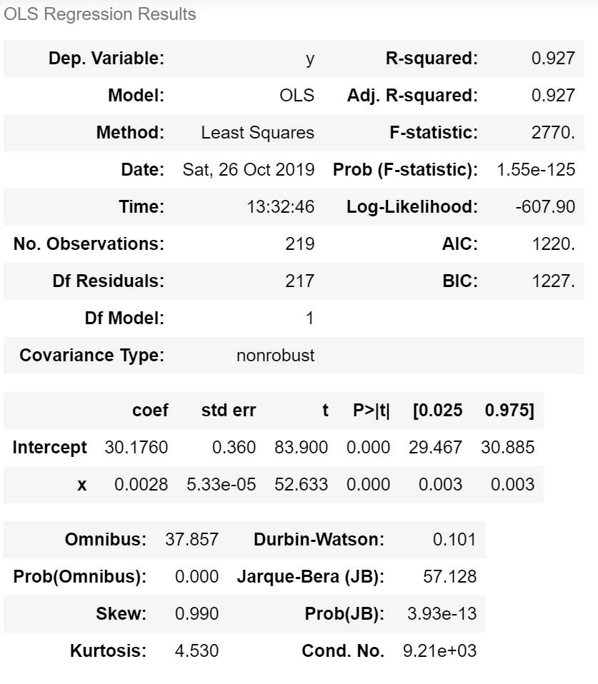
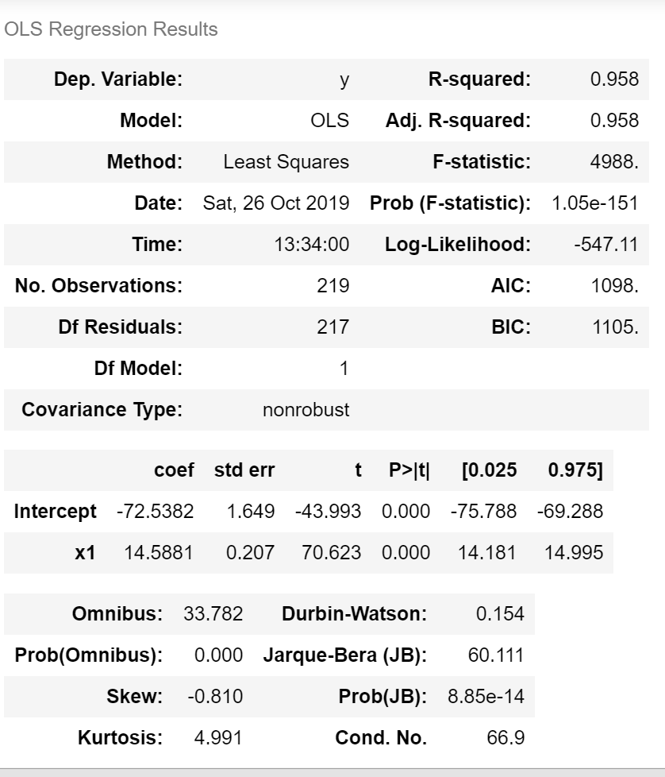
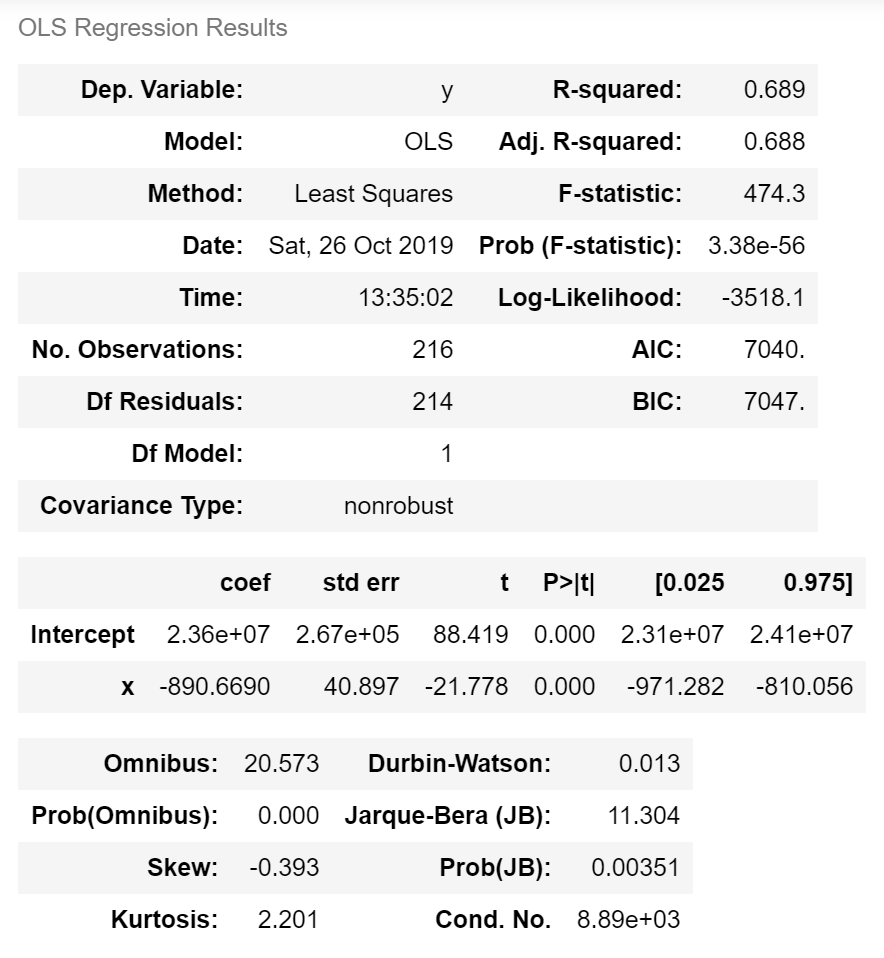
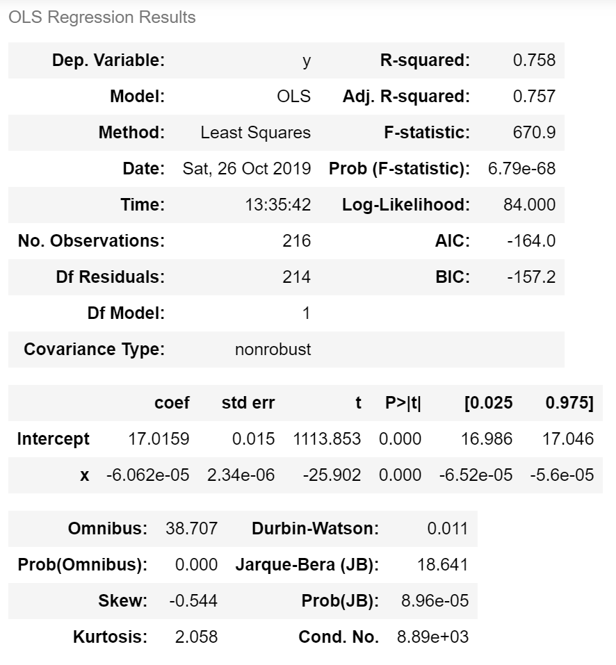
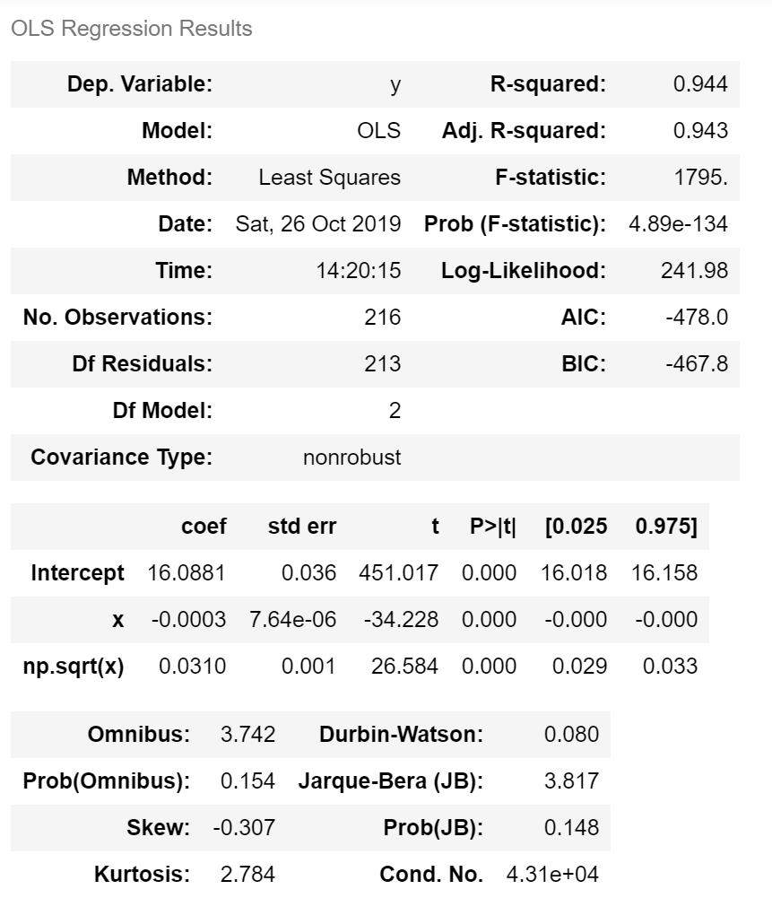

# Homework 1 Solutions 

## Problem 1

Group for the second project component:
1) Manvita Markala
2) Bishistha Mukherjee
3) Romil Rathi
4) Konanki Sai Charan

## Problem 2

### Choose and critique one of the visualization by one of your fellow classmates for HW 1 Problem 2 (distribution of income across countries and continents over time). Include a link to the original.

For the visualisations for distribution of income across countries and continents over time, I have looked into the graphs presented in:
https://github.com/Omairss/ds5500_hw1/blob/master/Homework1.ipynb

### Describe the visualization and how it is similar and/or different from yours. Is it easy to interpret? Does it effectively visualize what is being asked? Why or why not?

The visualisation consists of a heatmap of different countries across the world representing the trend of the income over the years. 
This visualisation is very unique and different from the way I have presented the graphs in terms of lines. Heat maps are interesting to interpret showing important areas in terms of the color coding(maybe areas of concerns/interest) . The abbreviated country names, and absense of the legend explanation makes it a little difficult to understand what extreme red and extreme blue indicates and which countries represent numbers. It would have been better to first show a comparison across continents and then a split within countries.

The second stacked line is a good thought in a way of showing the top to bottom countries that contribute to the income and their distribution over time. Again, a split with continent and country level and full names of countries would make the intepretation easier. Some of the countries have similar color coding due to a vast variety of legend values, which could be avoided if there were smaller subsets interms of income buckets or countries.

## Problem 3

### Choose and critique one of the visualization by one of your fellow classmates for HW 1 Problem 3 (relationship between income, life expectancy, and child mortality over time). Include a link to the original.

For the visualisations for relationship between income, life expectancy, and child mortality over time, I have looked in the graphs presented in :
https://github.com/karangm-dev/ds5500-hw1/blob/master/app.pdf

### Describe the visualization and how it is similar and/or different from yours. Is it easy to interpret? Does it effectively visualize what is being asked? Why or why not?

The visualisation consists of income, life expectancy, and child mortality trends and correlation graphs at an overall level and 
also at an individual continent level to analyse each continents relationship. The trends are similar to the way I represented my graphs to understand how each of the individual metrics is changing over time both at an overall level and continent wise. 

The most interesting aspect of the visualisation was the correlation graph over time, each of the 9 cross 9 grid represents the relationship between the metrics (2 at a time) over the years which I particulary found very interesting and easy to intepret.The last conclusion drawn from the correlation graph which is mentioned in the analysis seems very apt and crisp with respect to the visualisation.

## Problem 4

### Choose and fit one or more models to quantify the relationship betweem income (GDP per capita) and life expectancy over time

Firstly I constructed a dataframe consisting of income, life expectancy values across time and different countries. To build a model against the two metrics over time, I wanted to aggregate the quantities to get a time level data and eliminate country specific information and thus formed a dataframe grouped by time, and determined the average income and average life expectancies.

Figure 1 shows the relationship between income and life expectancy over time. The relationship looks somewhat linear in the sense, with increasing income we observe an increase in life expectancy, which is expected out of intuition.

![Lifeexpectancy vs income[]{label="fig:Lifeexpectancyvsincome"}](Q4.1.png)
###### Figure 1: Life Expectancy Vs Income

Then I constructed a simple linear regression for the two metrics and found that they indeed capture a linear relationship. The reason I chose linear regression is because the data was very finite and small and also it was difficult to show cross dimensions given three attributes namely time, income and expectancy. The R squared for this regression analysis turned out to be 0.925 which was good in terms of explaining the relation

![Q4.2[]{label="fig:Q4.2"}](Q4.2.png)
###### Figure 2: Linear Regression between Income and Life Expectancy

###### Figure 3: Ordinary Least Square Regression Results

But I further wanted to understand the relationship better and increase the R squared coefficient as its possible to have higher value because of lesser number of data points and thus applied a log tranformation for income and produced the regression curve. After doing this I got an R squared of 0.958 which is definitely an improvement from the one i observed previously but further data tranformations could have helped in fitting the model better, but it could also lead to over-fitting in these cases.

![Q4.3[]{label="fig:Q4.3"}](Q4.3.png)
###### Figure 4: Linear Regression between log(Income) and Life Expectancy

###### Figure 5: Ordinary Least Square Regression Results

Based on the above regression analysis, The equation of the line/curve can be deduced to Y=A.Log(X)+B

## Problem 5

### Choose and fit one or more models to quantify the relationship betweem income (GDP per capita) and child mortality over time.

Firstly I constructed a dataframe consisting of income, child mortality values across time and different countries. To build a model against the two metrics over time, I wanted to aggregate the quantities to get a time level data and eliminate country specific information and thus formed a dataframe grouped by time, and determined the average income and total child mortality values.

Figure 6 shows the relationship between income and child mortality over time. The relationship looks somewhat linear but negatively co-related in the sense, with increasing income we observe a decrease in child mortality, which is kind of expected out of intuition.

![Q5.1[]{label="fig:Q5.1"}](Q5.1.png)
###### Figure 6: Income Vs Child Mortality

Then I constructed a simple regression for the two metrics and found that they indeed capture a negative relationship. The reason I chose linear regression is because the data was very finite and small and also it was difficult to show cross dimensions given three attributes namely time, income and child mortality. The R squared for this regression analysis turned out to be 0.689 and it needed further data transformations/modelling to understand the relationship better.

![Q5.2[]{label="fig:Q5.2"}](Q5.2.png)
###### Figure 7: Linear Regression between Income Vs Child Mortality

###### Figure 8: Ordinary Least Square Regression Results

Then I built some more models by performing some data transformations on my x and y variables. The first data trasformation in figure 9 shows the model between log(Child Mortality) Vs Income and has achieved an R squared of 0.758 and then I further applied some data transformation shown in figure 11 and represented a model between 'log(Child Mortality) Vs Income+sqrt(Income)' - A combination of sqrt and linear variables and attained a good R squared of 0.944 and the graph looks to have the line and scatter plot lying close to each other.

Performing a test analysis would help determing whether this model has been involved with a lot of smoothing and thus would result in over fitting or not. We also observe that the coffecients of X are negative in this case as opposed to problem 4 since Income and mortality are following a negative trend as seen in figure 6

![Q5.3[]{label="fig:Q5.3"}](Q5.3.png)
###### Figure 9: Linear Regression between Income Vs log(Child Mortality)

###### Figure 10: Ordinary Least Square Regression Results

![Q5.4[]{label="fig:Q5.4"}](Q5.4.png)
###### Figure 11: Linear Regression between log(Child Mortality) Vs Income+sqrt(Income)

###### Figure 12: Ordinary Least Square Regression Results

The equation to explain the relationship between Life Expectancy Vs Child Mortality would then become log(Y)=A.X+B.sqrt(X)+C where A is negative.
